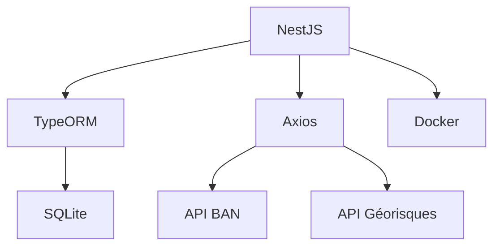

# SkanderChayoukhi-Klaire_coding_game

# 🌍 API Adresse & Risques Environnementaux

[](https://nestjs.com/)
[](https://www.docker.com/)
[](https://sqlite.org/)

## 🚨 Correction Critique

**URL corrigée pour l'API Géorisques** (l'originale était obsolète) :

```bash
https://georisques.gouv.fr/api/v1/resultats_rapport_risque?latlon={lon},{lat}
```

## 🚀 Fonctionnalités

- 🔍 Recherche d'adresses via l'API BAN (Base Adresse Nationale)
- ⚠️ Consultation des risques environnementaux via l'API Géorisques
- 💾 Persistance des données en SQLite
- 🐳 Containerisation avec Docker

## 🛠 Stack Technique



## 🏗 Installation

1. Cloner le dépôt :

   ```bash
   git clone https://github.com/SkanderChayoukhi/SkanderChayoukhi-Klaire_coding_game.git
   cd Klaire_coding_game
   ```

2. Configurer l'environnement :

   ```bash
   cp .env.example .env
   ```

   Modifiez les variables d'environnement si nécessaire.

3. Démarrer les services :
   ```bash
   docker compose up --build
   ```

## 📚 Endpoints principaux

### Recherche d'adresse

- **POST** `/api/addresses`
  - **Body** : `{ "q": "8 bd du Port" }`
  - **Réponse (201)** :
    ```json
{
  "id": 1,
  "label": "8 bd du Port, 56170 Sarzeau",
  "housenumber": "8",
  "street": "bd du Port",
  "postcode": "56170",
  "citycode": "56242",
  "latitude": 47.58234,
  "longitude": -2.73745
}
 ```
  
    


- **Erreurs** :
  - 400 : Requête invalide (`q` vide ou manquant)
  - 404 : Adresse non trouvée

### Consultation des risques environnementaux

- **GET** `/api/addresses/id/risks`
  - **Réponse (200)** :
    ```json
    {
      "risks": [
        {
          "type": "Inondation",
          "description": "Zone inondable"
        }
      ]
    }
    ```


- **Erreurs** :
  - 404 : Adresse non trouvée

### Healthcheck

- **GET** `/api/health`
  - **Réponse** : `{ "status": "OK" }`


#### 🩺 Health check Docker

Un health check Docker est un mécanisme intégré permettant de vérifier régulièrement si votre application dans le conteneur fonctionne correctement.

Exemple dans le `docker-compose.yml` :

```yaml
healthcheck:
  test: ["CMD-SHELL", "curl -f http://localhost:8000/api/health || exit 1"]
  interval: 30s
  timeout: 10s
  retries: 3
```

| Paramètre  | Explication                                                                                                    |
| ---------- | -------------------------------------------------------------------------------------------------------------- |
| `test`     | Commande exécutée pour vérifier la santé (ici, un `curl` sur `/api/health` qui échoue si le statut HTTP ≥ 400) |
| `interval` | Fréquence des vérifications (toutes les 30 secondes)                                                           |
| `timeout`  | Délai maximal d’attente pour la commande (10 secondes)                                                         |
| `retries`  | Nombre d’échecs consécutifs avant de marquer le conteneur comme "unhealthy"                                    |

**Visualisation :**

- `docker ps` affiche le statut du conteneur (`(healthy)` ou `(unhealthy)`).
- `docker inspect --format='{{json .State.Health}}' <container>` donne le détail des checks.

L’endpoint `/api/health` doit toujours retourner `{ "status": "OK" }` (HTTP 200) si l’application fonctionne correctement.

## ⚙️ Variables d'environnement nécessaires

| Variable         | Description                     | Exemple          |
| ---------------- | ------------------------------- | ---------------- |
| TYPEORM_DATABASE | Chemin vers la base SQLite      | ./data/db.sqlite |
| APP_PORT         | Port d'écoute de l'API          | 8000             |
| ...              | (Voir `.env.example` pour plus) |                  |

## 🧪 Tests

Les tests unitaires sont situés dans `src/address/address.service.spec.ts` et end-to-end sont situés dans le dossier `test/` :

```bash
npm run test
npm run test:e2e
```

## 🗂 Structure du projet

```
.
├── src/
│   ├── address/
│   ├── health/
│   └── ...
├── test/
├── data/
├── docker-compose.yml
├── .env.example
├── README.md
└── ...
```

## 📝 Documentation additionnelle

- Un fichier `.env.example` est fourni pour faciliter la configuration.

---
