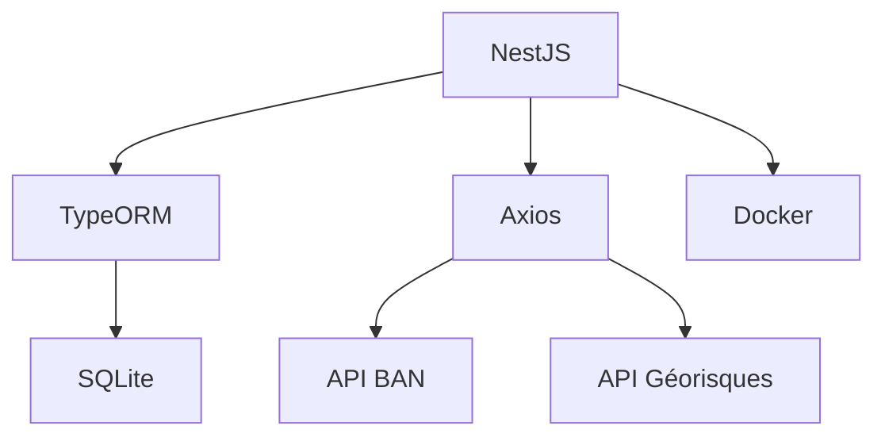

# SkanderChayoukhi-Klaire_coding_game

# 🌍 API Adresse & Risques Environnementaux

[](https://nestjs.com/)
[](https://www.docker.com/)
[](https://sqlite.org/)

## 🚨 Correction Critique

**URL corrigée pour l'API Géorisques** (l'originale était obsolète) :

```bash
https://georisques.gouv.fr/api/v1/resultats_rapport_risque?latlon={lon},{lat}
```

## 🚀 Fonctionnalités

- 🔍 Recherche d'adresses via l'API BAN (Base Adresse Nationale)
- ⚠️ Consultation des risques environnementaux via l'API Géorisques
- 💾 Persistance des données en SQLite
- 🐳 Containerisation avec Docker

## 🛠 Stack Technique



## 🏗 Installation

1. Cloner le dépôt :

   ```bash
   git clone https://github.com/SkanderChayoukhi/SkanderChayoukhi-Klaire_coding_game.git
   cd SkanderChayoukhi-Klaire_coding_game
   ```

2. Configurer l'environnement :

   ```bash
   cp .env.example .env
   ```

   Modifiez les variables d'environnement si nécessaire.

3. Démarrer les services :
   ```bash
   docker compose up --build
   ```

## 📚 Endpoints principaux

### Recherche d'adresse

- **POST** `/api/addresses`
  - **Body** : `{ "q": "8 bd du Port" }`
  - **Réponse (201)** :
    ```json
    {
      "id": 1,
      "label": "8 bd du Port, 56170 Sarzeau",
      "housenumber": "8",
      "street": "bd du Port",
      "postcode": "56170",
      "citycode": "56242",
      "latitude": 47.58234,
      "longitude": -2.73745
    }
    ```
  - **Erreurs** :
    - 400 : Requête invalide (`q` vide ou manquant)
    - 404 : Adresse non trouvée

### Consultation des risques environnementaux

- **GET** `/api/addresses/:id/risks`
  - **Réponse (200)** :
    ```json
    {
      "risks": [
        {
          "type": "Inondation",
          "description": "Zone inondable"
        }
      ]
    }
    ```
  - **Erreurs** :
    - 404 : Adresse non trouvée

### Healthcheck

- **GET** `/api/health`
  - **Réponse** : `{ "status": "OK" }`

## ⚙️ Variables d'environnement nécessaires

| Variable         | Description                     | Exemple          |
| ---------------- | ------------------------------- | ---------------- |
| TYPEORM_DATABASE | Chemin vers la base SQLite      | ./data/db.sqlite |
| APP_PORT         | Port d'écoute de l'API          | 8000             |
| ...              | (Voir `.env.example` pour plus) |                  |

## 🧪 Tests

Les tests unitaires et end-to-end sont situés dans le dossier `test/` :

```bash
npm run test
npm run test:e2e
```

## 🗂 Structure du projet

```
.
├── src/
│   ├── address/
│   ├── health/
│   └── ...
├── test/
├── data/
├── docker-compose.yml
├── .env.example
├── README.md
└── ...
```

## 📝 Documentation additionnelle

- Un fichier `.env.example` est fourni pour faciliter la configuration.

---
